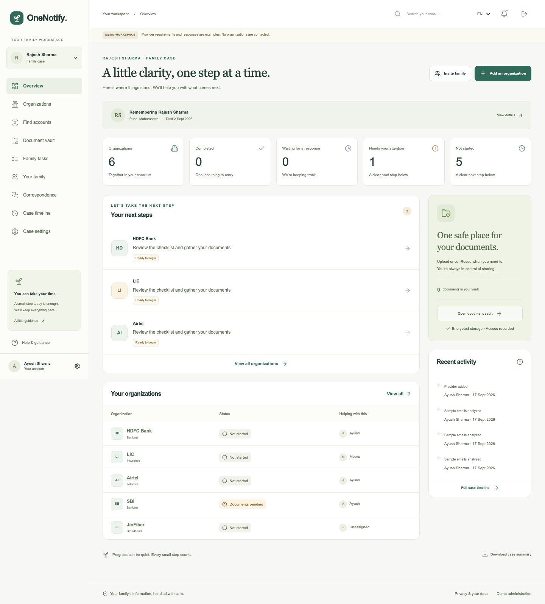
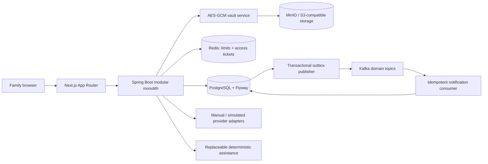
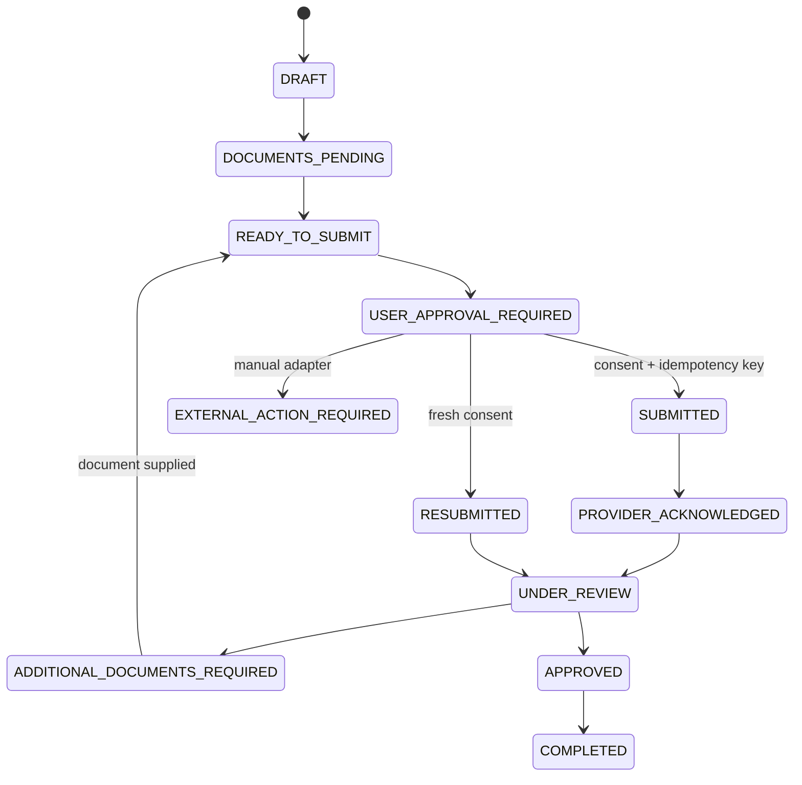

# OneNotify

**Tell OneNotify once. Organize everything from one place.**

An India-focused family workspace for the administrative work after a death. OneNotify brings organization checklists, original documents, explicit sharing consent, family tasks, correspondence, and an auditable history together.

**Current release: local testing.** The complete local workflow runs without hosting, paid services, AI credentials or provider access. Hosting is deferred. Start with the [testing guide](docs/TESTING.md); use [CONTRIBUTING.md](CONTRIBUTING.md) for development and repository checks.



## Run locally

Install Docker with Compose, then run from this directory:

```sh
git clone https://github.com/ayushsingh1524/OneNotify.git
cd OneNotify
docker compose up -d --build --wait
```

The first build downloads images and dependencies. Wait for the backend to become healthy before opening **http://localhost:3000**. Defaults work without creating an environment file. To customize them, copy `.env.example` to `.env` and set your own values.

| Local service | Address |
|---|---|
| Application | http://localhost:3000 |
| Backend health | http://localhost:8080/actuator/health |
| Swagger UI | http://localhost:8080/swagger-ui/index.html |
| OpenAPI JSON | http://localhost:8080/v3/api-docs |
| Local test email inbox | http://localhost:8025 |
| MinIO console | http://localhost:9001 |
| PostgreSQL | localhost:15432 |
| Redis / Kafka | localhost:6379 / localhost:9092 |

All published Compose ports bind to loopback. PostgreSQL uses 15432 to avoid conflicting with an existing local installation. Stop services with `docker compose down`; named volumes retain data. Do not delete volumes if you need your cases.

### Demo sign-in

| Account | Email | Password |
|---|---|---|
| Case owner / demo registry admin | `family@example.test` | `Family-demo-2026!` |
| Family contributor | `mother@example.test` | `Family-demo-2026!` |

These are intentionally public **local demo credentials**, not production secrets. Seed data includes a clearly fictional Rajesh Sharma case, two family members, twelve providers across Indian service categories, four unstarted workflows, and family tasks. No uploaded document or completed provider action is invented.

## What works

- Registration, sign-in, short-lived JWTs, rotating hashed refresh tokens, logout, and emailed password resets through local Mailpit. Non-demo registration requires email verification.
- A five-step case wizard with a server-side save-and-return draft, deceased profile, optional last-four identity references, and multiple family cases.
- Case-scoped authorization for every case resource. Owner, family admin, contributor, viewer, and professional advisor roles.
- Family invitations, revocation, organization assignment, tasks, comments, mentions, and correspondence attachments.
- An AES-256-GCM encrypted MinIO/S3-compatible document vault with SHA-256 hashes, unchanged originals, versions, access logs, single-use 60-second access tickets, previews, and deletion requests.
- A provider registry and snapshots of requirements for each request. Missing-document detection is deterministic.
- A validated state machine, explicit consent for selected documents, transactional audits, concurrent idempotency protection, and a complete simulated provider lifecycle.
- Manual discovery, explicitly simulated email import, PDF embedded-text discovery, and family-confirmed possible account relationships.
- Manual provider outcome recording with a required reference and correspondence note; family-reported updates remain distinct from verified integrations.
- Transactional outbox events, real Kafka publishing, idempotent notification consumption, retries, dead-letter topics, and exhausted-job replay.
- Reminder and escalation scheduling with source-labelled deadlines; no invented statutory deadlines.
- In-app notifications; outbound email/SMS/WhatsApp integration seams with mock delivery. Password-reset and verification email use Mailpit.
- Search across providers, files, tasks, correspondence, family, and activity.
- PDF case reports and ZIP provider packages containing a draft cover letter, manifest, and unchanged required files.
- Protected provider administration, per-provider requirement templates, configuration drafts, event operations, and operational metrics.
- Responsive, keyboard-usable UI, English/Hindi navigation catalog, and optional browser speech input.

## Demo lifecycle

1. Sign in, then create a family case or open the seeded case.
2. Open **Document vault** and upload sample files as **Death certificate** and **User identity**. A tiny sample PNG is in `scripts/fixtures/sample.png`.
3. Use **Find accounts** to add SBI or LIC. Try **Import sample messages** and explicitly confirm a suggestion.
4. Open the organization and choose **Check & prepare request**. Missing documents are highlighted.
5. Select the exact documents, check the authorization box, then **Approve & simulate submission**.
6. Kafka publishes the domain event and the in-app notification is created asynchronously.
7. Choose **Simulate next response** three times: acknowledgement → review → additional nominee document request.
8. Upload a **Nominee document**, prepare again, and give fresh consent.
9. Simulate review → approval → completion. The dashboard and append-only timeline update.
10. Download the organization package and final PDF case summary.

[Full walkthrough](docs/DEMO_GUIDE.md) · [Implementation and verification tracker](docs/PROGRESS.md)

## Architecture



The backend is one deployable modular monolith. JPA owns the workflow aggregate and locking; JDBC repositories handle explicit relational queries and projections. Controllers accept validated DTOs and delegate business actions to services. PostgreSQL transactions couple workflow changes, consent consumption, audit records, and outbox writes.

### Stack

Next.js 16 / React 19 · TypeScript · Tailwind CSS 4 · shadcn-style Radix Button · React Hook Form · Zod · TanStack Query · Java 21 · Spring Boot 3.5 · Spring Security · Spring Data JPA · Flyway · PostgreSQL 17 · Redis 7 · Kafka 3.9 · MinIO · PDFBox · Docker Compose.

### Workflow



Additional validated states cover pause, cancellation, rejection, failure, and escalation. There is no generic “set status” API.

## Development & checks

For host development, first stop the app containers with `docker compose stop frontend backend`, leaving infrastructure running. Use separate terminals for the host backend and frontend:

```sh
# Backend (Java 21+, Maven 3.9+)
mvn -f services/backend/pom.xml test
mvn -f services/backend/pom.xml spotless:check
mvn -f services/backend/pom.xml spring-boot:run

# Frontend (Node 22+)
cd apps/web
npm ci
npm run dev
npm run lint
npm run typecheck
npm test
npm run build
npx playwright install chromium
npm run test:e2e
```

From the repository root, with the backend running:

```sh
node scripts/integration.mjs
node scripts/security-extra.mjs
node scripts/manual-lifecycle.mjs
```

The integration suite creates clearly named test accounts and cases. It verifies missing documents, false/incomplete consent, cross-family isolation, viewer permissions, concurrent duplicate submission, encryption round-trip, single-use document access, membership revocation, simulated additional-document handling, completion, search, PDF/ZIP exports, history, and Kafka notification delivery. Testcontainers verifies PostgreSQL migrations and append-only audit enforcement. Browser tests exercise desktop/mobile navigation and the complete user journey.

Docker image builds run backend tests and a frontend production compile. Full browser/API integration requires the running stack and is invoked separately. A host Java 25 installation works locally; the backend Docker image builds/runs on Java 21.

## Environment

See [.env.example](.env.example). `DEMO_ENABLED=true` enables seed data, local identity shortcuts, simulated provider controls, and the placeholder scanner. `JWT_SECRET`, `VAULT_KEY` (base64 32-byte AES key), database credentials, and storage credentials must be unique for any nonlocal environment. Non-demo startup rejects the example signing/vault keys and insecure cookies. Set `SECURE_COOKIE=true` behind HTTPS. Set `BACKEND_URL` for frontend proxying, `APP_ORIGIN` for email links, and the database, Redis, Kafka, MinIO, and mail endpoints as documented in [Security](docs/SECURITY.md).

## Security and honest boundaries

**This is a locally verified demonstration, not a certification for handling live bereavement records.** Production deployment requires an independent security/privacy review, managed keys, a real malware scanner, verified provider configurations, retention operations, backups, monitoring, and operational ownership.

- Every seeded provider rule is **DEMO**, even where the organization name and website are real. `lastVerifiedAt` is unset. No official procedure or deadline is asserted.
- No bank, insurer, government portal, telecom operator, or Gmail account is integrated. API, email, form, portal, and manual modes prepare work for a human. Only the explicitly simulated adapter reports a simulated submission.
- Image OCR is an interface gap, not a hidden OCR service. PDF analysis reads existing embedded text; AI suggestions are deterministic and require human review.
- The local demo signature scanner is **not antivirus**. A real ClamAV adapter and staging service are now provided; daemon/signature verification on the chosen host remains required.
- Invitation emails are not sent. In demo mode, registering an invited email is sufficient to join; outside demo mode email verification is required.
- Hindi navigation is translated; detailed content remains English. PDF output currently transliterates unsupported characters to `?` using the built-in font. Add an embedded Unicode font before multilingual report delivery.
- Deletion is a recorded review request, not immediate physical erasure. Review and cryptographic erasure operations need an operator policy.
- Provider packages do not invent official forms; they instruct users to obtain current forms directly.
- JSON admin configuration drafts are persisted for review but do not replace the reviewed runtime state graph or source translation catalog.

## Repository

```text
apps/web/                 Next.js application, unit and Playwright tests
services/backend/         Spring Boot modules, migrations, JUnit tests
infra/                    Local infrastructure notes
scripts/                  API integration suite and sample fixtures
docs/                     Architecture, API, security, demo and verification
compose.yaml              Complete local stack
```

## Documentation

[Architecture](docs/ARCHITECTURE.md) · [Data model](docs/DATA_MODEL.md) · [Workflow engine](docs/WORKFLOW_ENGINE.md) · [Provider adapters](docs/PROVIDER_ADAPTERS.md) · [API](docs/API.md) · [Security](docs/SECURITY.md) · [AI usage](docs/AI_USAGE.md) · [Privacy](docs/PRIVACY.md) · [Demo guide](docs/DEMO_GUIDE.md) · [Roadmap](docs/ROADMAP.md)

## Product measures

Time spent in case creation, time from case creation to provider submission, average unresolved workflows per case, completed workflow duration, repeated document reuse across submissions, resolved providers, action backlog, and overdue workflow estimates. Admin metrics are operational aggregates and do not contain file contents. Small local sample sizes are not outcome claims.

## Current next step

Run the [local testing checklist](docs/TESTING.md), record issues with sample data, and review changes through Git. Hosting and production activation are deferred. Future capabilities and production requirements remain in [Roadmap](docs/ROADMAP.md).

## Optional future staging

The post-demo hardening pass adds revocable access sessions, a fail-closed ClamAV adapter, authenticated SMTP settings, separate staging database roles, an HTTPS/IP-restricted Compose overlay, and a disposable database restore drill. No live hosting or provider API integration has been created.

[Staging setup](docs/STAGING.md) · [Hosting options](docs/HOSTING_OPTIONS.md) · [Operations](docs/OPERATIONS.md) · [First provider pilot](docs/PROVIDER_PILOT.md) · [Current progress](docs/PROGRESS.md)
