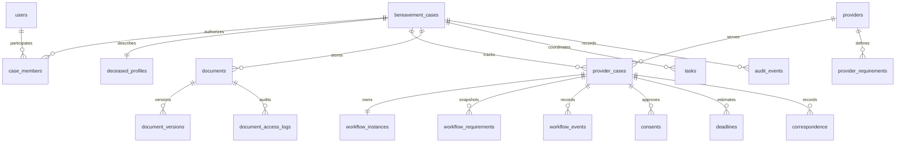

# Data model

UUID primary keys, foreign keys and scoped uniqueness enforce relationships. Flyway owns the schema. Hibernate validates (never creates) its workflow mapping.

Supporting tables: refresh tokens, reset tokens, verification tokens, onboarding drafts, provider adapter configuration, correspondence attachments, notifications, discovery candidates, AI analyses, outbox events, consumer deduplication, submission keys, admin configuration drafts, and product timing metrics.

JSONB is limited to event envelopes, consent document IDs/shared field lists, analysis outputs, onboarding drafts and configuration. Core relationships remain normalized. A document upload is a distinct immutable file; `version` tracks the sequential category upload number within a case and `document_versions` stores its original storage/checksum record. A production revision UI should group explicit document lineages rather than infer that two unrelated files are replacements.

Indexes cover case membership, case documents, organization workflows, time-ordered history, active deadlines, tasks, notifications and pending outbox delivery. The workflow has an optimistic version column and command-level pessimistic locks. History triggers reject updates/deletes. Sensitive internal storage paths and access/security metadata are omitted from user-facing document lists and reports.
